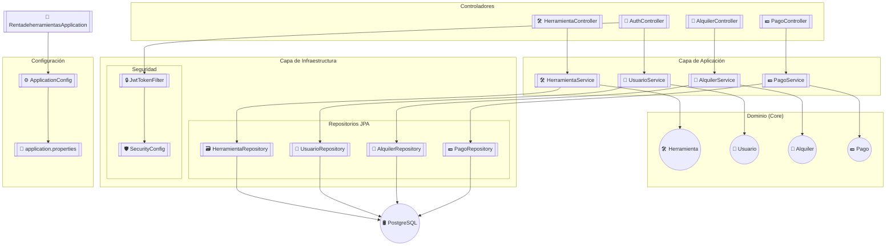
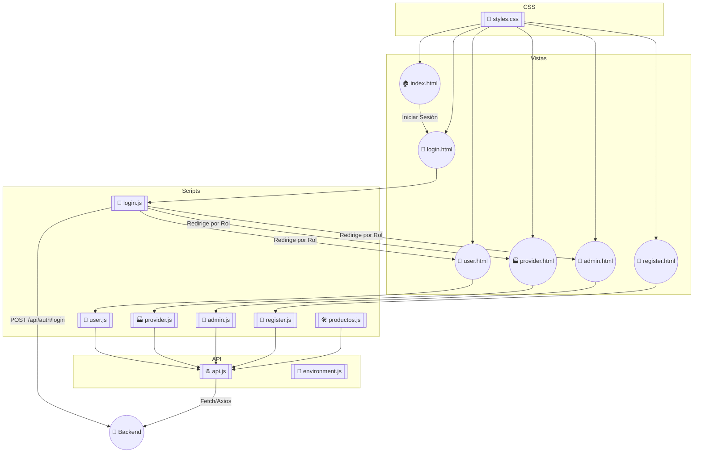
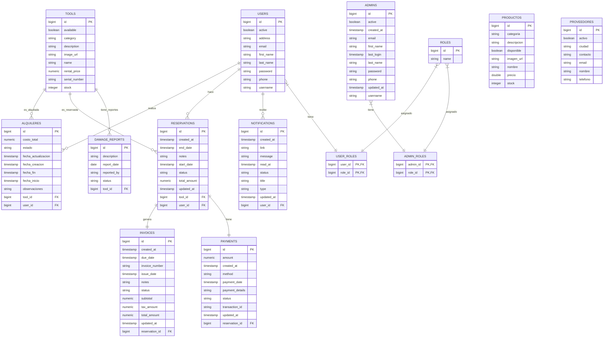

# Plataforma de Renta de Herramientas y Equipos de Construcción 🛠️

## Descripcion.

Este proyecto tiene como objetivo desarrollar una Plataforma de Renta de Herramientas y Equipos de Construcción, donde los proveedores puedan registrar su inventario y los clientes puedan alquilar herramientas, programar entregas y gestionar pagos de forma eficiente.

[](https://spring.io/projects/spring-boot)
[](https://www.oracle.com/java/)
[](https://www.postgresql.org/)

> **Frontend Repository**: [GitHub Link](https://github.com/Jhormancastella/Proyecto_RentaHerramientas_Frontend_Jhormancastellanos_LuisTalero_LisethArevalo)

## 🚀 Ejecución del Proyecto

## clonar los siguientes repositorios

```bash
# Backend
git clone https://github.com/Jhormancastella/Proyecto_RentaHerramientas_backend_Jhormancastellanos_LuisTalero_LisethArevalo.git
mvn spring-boot:run
```

```bash
# Frontend
git clone https://github.com/Jhormancastella/Proyecto_RentaHerramientas_Frontend_Jhormancastellanos_LuisTalero_LisethArevalo.git
open index.html
```

---

## 📊 Diagrama de Flujo del Backend 



## 📊 Diagrama de Flujo del Frontend



## 📊 Diagrama Entidad-Relación (ER)



## 🔐 Credenciales de Prueba Automáticas

Al iniciar el servidor, se crean estos usuarios (generados por `data.sql`):

| Rol           | Username     | Password       |
| ------------- | ------------ | -------------- |
| **Admin**     | `admin`      | `admin123`     |
| **Proveedor** | `proveedor1` | `proveedor123` |
| **Cliente**   | `user1`      | `password1`    |

---

---

## 🛠️ Instalación y Configuración del Proyecto

### 📋 Requisitos Previos

- **Java JDK 21** ([Descargar](https://www.oracle.com/java/technologies/javase/jdk21-archive-downloads.html))
- **PostgreSQL 16** ([Descargar](https://www.postgresql.org/download/))
- **Maven 3.9+** ([Instrucciones](https://maven.apache.org/install.html))
- **Live Server**
- **Visual Studio Code** (Recomendado) o cualquier IDE para Java/Web

### 🔧 Pasos para Configurar el Proyecto

#### 1. Configurar Base de Datos (PostgreSQL)

1. Crear una base de datos llamada `renta_herramientas`
2. Configurar credenciales en `backend/src/main/resources/application.properties`:

```properties
spring.datasource.url=jdbc:postgresql://localhost:5432/rentadeherramientas
spring.datasource.username=Postgres
spring.datasource.password=tu_contraseña_postgres
spring.jpa.hibernate.ddl-auto=update
```

#### 2. Ejecutar el Backend (Spring Boot)

```bash
cd Proyecto_RentaHerramientas_backend_Jhormancastellanos_LuisTalero_LisethArevalo
mvn spring-boot:run
```

✅ El servidor se iniciará en `http://localhost:8080`

#### 3. Ejecutar el Frontend

1. Abrir el proyecto frontend en VSCode
2. Instalar la extensión **Live Server** (si no la tienes)
3. Abrir `index.html` y hacer clic en **Go Live** (esquina inferior derecha de VSCode)
4. Se abrirá automáticamente en `http://localhost:5500`

---

## 🖥️ Flujo de Ejecución del Sistema

1. **Página de Bienvenida** (`index.html`):
   - Interfaz inicial con logo y descripción del sistema
   - Botón "registro" que redirige a `/register.html`

2. **Login**:
   - Introducir credenciales de prueba (admin/admin123, etc.)
   - El frontend consume el endpoint `POST /api/auth/Authenticate`

3. **Redirección según Rol**:
   - `ADMIN` → Panel de administración (`/admin/admin.html`)
   - `PROVEEDOR` → Gestión de herramientas (`/proveedor/provider.html`)
   - `CLIENTE` → Catálogo de herramientas (`/cliente/user.html`)

---

## 🚦 Estructura de Archivos (Frontend)

```plaintext
📦 PROYECTO_RENTAHERRAMIENTAS_FRONTEND_JHORM...
│
├── 📂 css/ # 🎨 Estilos globales
│ └── 🌀 styles.css # (Archivo principal)
│
├── 📂 images/ # 🖼️ Assets visuales
│ └── 📄 .gitkeep # (Carpeta vacía)
│
├── 📂 js/ # 🧠 Lógica JavaScript
│ ├── 📜 admin.js # 👨💼 Panel administrador
│ ├── 📜 charts.js # 📊 Gráficos (opcional)
│ ├── 📜 environment.js # 🌱 Config variables
│ ├── 📜 login.js # 🔑 Autenticación
│ ├── 📜 productos.js # 🛠️ Gestión de herramientas
│ ├── 📜 provider.js # 🏭 Panel proveedor
│ ├── 📜 register.js # 📝 Registro usuarios
│ ├── 📜 user.js # 👤 Panel cliente
│ └── 📜 welcome.js # 🏠 Página inicial
│
├── 📂 media/ # 📁 Multimedia adicional
│ └── 📄 .gitkeep # (Carpeta vacía)
│
├── 📂 pages/ # 🖥️ Vistas HTML
│ ├── 📄 admin.html # 👨💼 Dashboard admin
│ ├── 📄 login.html # 🔑 Inicio de sesión
│ ├── 📄 provider.html # 🏭 Vista proveedor
│ ├── 📄 register.html # 📝 Registro
│ ├── 📄 user.html # 👤 Perfil cliente
│ └── 📄 index.html # 🏠 Página principal
│
├── 📂 api/ # 🌐 Conexión backend
│ └── 📜 api.js # (Fetch/Axios config)
│
├── 📂 bootstrap/ # 🅱️ Estilos Bootstrap
│ └── 📄 bootstrap.min.css # (Si se usa)
│
└── 📄 README.md # 📖 Documentación
```

## 🗂️ Estructura del Proyecto (Backend)

```plaintext
📦 rentadeherramientas/
├── 📂 src/
│ ├── 📂 main/
│ │ ├── 📂 java/
│ │ │ └── 📂 com.rentadeherramientas.rentadeherramientas/
│ │ │ ├── 📂 Config/ # ⚙️ Configuraciones
│ │ │ ├── 📂 application.services/ # 🛠️ Servicios
│ │ │ ├── 📂 domain.entity/ # 🏷️ Entidades JPA
│ │ │ ├── 📂 dto/ # 📦 Objetos de transferencia
│ │ │ ├── 📂 request/ # 📥 Peticiones HTTP
│ │ │ ├── 📂 response/ # 📤 Respuestas HTTP
│ │ │ ├── 📂 exceptions/ # ❌ Excepciones
│ │ │ ├── 📂 exception/ # 🚨 Manejo de errores
│ │ │ ├── 📂 infrastructure/ # 🌐 Infraestructura
│ │ │ └── 🎯 RentadeherramientasApplication.java # 🚀 Clase principal
│ │ └── 📂 resources/ # 📄 Recursos
│ └── 📂 target/ # 🏗️ Generado por Maven
│ └── 📂 generated-sources/annotations/ # 🔄 Código generado
├── 📂 .mvn/ # ⚙️ Config Maven Wrapper
├── 📂 .vscode/ # 🔧 Configuración IDE
├── 📄 .gitattributes # 🔍 Reglas Git
├── 📄 .gitignore # 🙈 Archivos ignorados
├── 📄 README.md # 📖 Documentación
├── 📄 mvnw # 🐧 Maven Wrapper (Linux)
├── 📄 mvnw.cmd # � Maven Wrapper (Windows)
└── 📄 pom.xml # 📦 Dependencias Maven
```

---

## 🔍 Solución de Problemas Comunes

### ❌ El backend no se inicia

- Verifica que PostgreSQL esté corriendo: `sudo service postgresql status`
- Revisa los logs de Spring Boot: `mvn spring-boot:run` muestra errores de conexión

### ❌ El frontend no conecta con el backend

- Asegúrate que CORS está habilitado en Spring Boot:

```java
@Bean
public WebMvcConfigurer corsConfigurer() {
    return new WebMvcConfigurer() {
        @Override
        public void addCorsMappings(CorsRegistry registry) {
            registry.addMapping("/**").allowedOrigins("http://localhost:5500");
        }
    };
}
```

### ❌ Live Server no funciona

- Instálalo desde VSCode Extensions (ID: ritwickdey.LiveServer)
- Alternativa: Usar `python3 -m http.server 8000` en la carpeta frontend
- 

## 🚨 Estado del Ejercicio

**Sin Culminar**  
*(En desarrollo activo)*

---

## 👥 Autores

<div style="display: flex; gap: 20px; align-items: center; margin-top: 15px;">
  
  <div>
    <h4>Jhorman Jesús Castellanos Morales</h4>
    <p>Desarrollador Backend</p>
    <a href="https://github.com/Jhormancastella" target="_blank">@Jhormancastella</a>
  </div>
</div>


<div style="display: flex; gap: 20px; align-items: center; margin-top: 15px;">
  
  <div>
    <h4>Luis Talero</h4>
    <p>Desarrollador Frontend</p>
        <a href="https://github.com/luistalero" target="_blank">@luistalero</a>
  </div>
</div>


<div style="display: flex; gap: 20px; align-items: center; margin-top: 15px;">
  
  <div>
    <h4>Liseth Arévalo</h4>
    <p>Diseñadora de Base de Datos</p>
        <a href="https://github.com/lisethflorez" target="_blank">@lisethflorez</a>
  </div>
</div>

